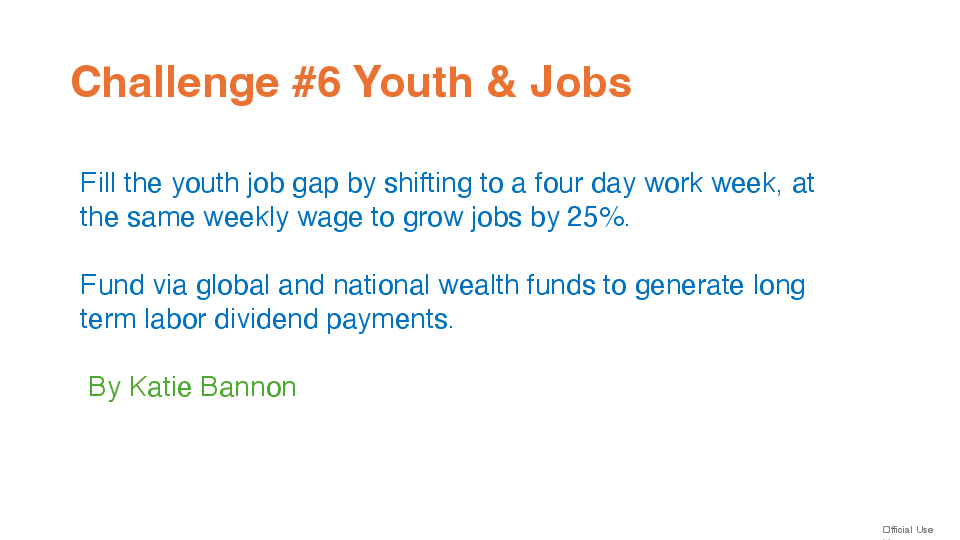
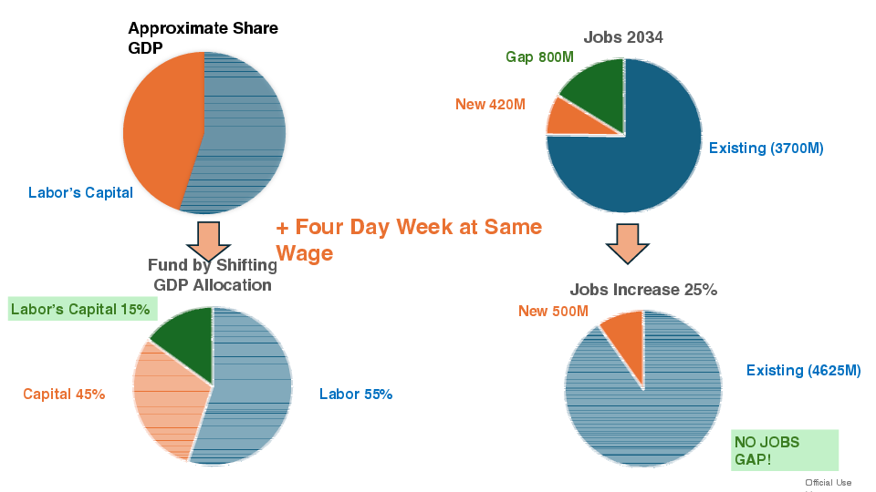

# Challenge #6 Youth & Jobs

By Katie Bannon.

## Overview
Proposal to fill the youth job gap by shifting to a four-day work week while keeping weekly wages constant, unlocking about 25% more jobs. The transition is funded through global and national wealth funds that generate long-term labor dividend payments.

## Team Members

- Katie Bannon

## Challenge Category Area

Category 6: Youth & Jobs — closing the youth job gap by redesigning work and funding mechanisms.

## Project Description

- Shift to a four-day work week at the same pay to expand hiring capacity and close the projected 800M youth job gap by 2034.
- Finance the shift through wealth funds that treat part of wages as labor’s capital, creating sustainable dividend payouts.
- Rebalance GDP allocation toward labor (illustrated split: 55% labor, 45% capital with 15% earmarked as labor’s capital) to support wage stability and funding.
- Modeled outcome: ~25% job increase (+500M jobs) yielding 4.625B jobs total, removing the gap.

## Links

- Challenge deck: `Challenge6YouthJobsKatieBannon.pdf`
