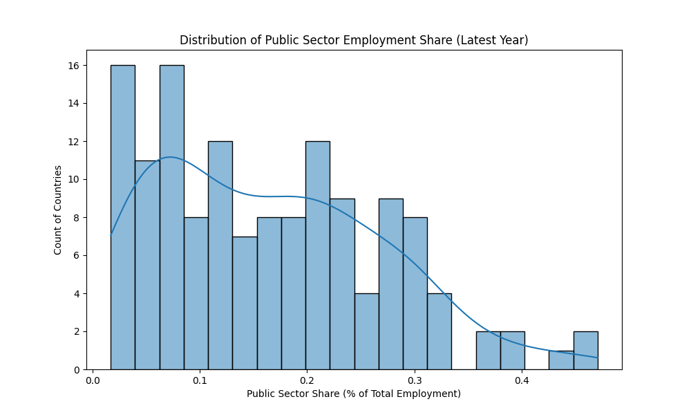

# Analysis Results

## Public Sector Employment Share
We analyzed the "Public sector employment as a share of total employment" (Indicator: `BI.EMP.TOTL.PB.ZS`) from the World Bank Worldwide Bureaucracy Indicators.

### Key Findings
*   **Top Countries**: Maldives (47%), Russia (45%), and Djibouti (43%) have the highest public sector employment shares.
*   **Distribution**: Most countries have a public sector share between 10% and 30%.

### Visualization

### Top 10 Countries
| Country | Year | Public Sector Share (%) |
| :--- | :--- | :--- |
| Maldives | 2019 | 47.1% |
| Russia | 2016 | 44.9% |
| Djibouti | 2017 | 42.8% |
| Ukraine | 2013 | 38.7% |
| Micronesia | 2005 | 38.2% |
| Kazakhstan | 2010 | 37.2% |
| Belgium | 2020 | 35.8% |
| Norway | 2020 | 32.8% |
| Denmark | 2020 | 32.5% |
| Saudi Arabia | 2013 | 32.2% |
