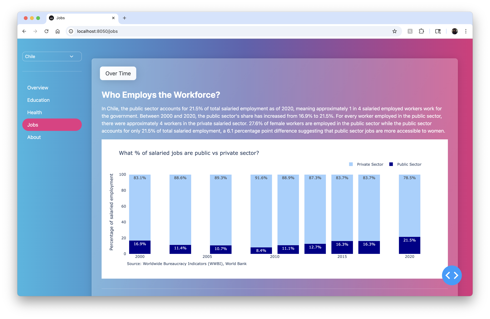
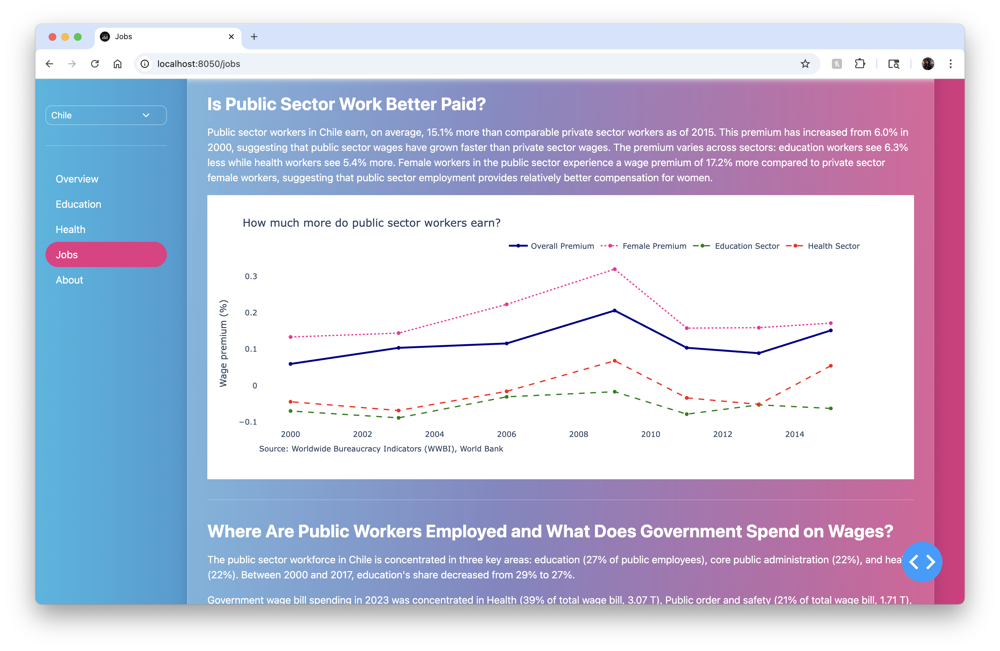

# Public Sector Jobs Dashboard

This project showcases how teams can structure analytical work in the DataDive repository while exploring a real policy challenge: **women’s employment in the public sector.**

## Overview

Team **JobInsights** built an interactive **Public Sector Jobs Dashboard** using **Next.js**, combining insights from multiple data sources (WWBI, BOOST, labor surveys) to help users understand:

- **Who works in the public sector** compared to the private sector  
- **How public sector wages compare** to private-sector wages  
- **Where public employees are concentrated** across functions like education, health, and core administration  
- **How women are represented** across sectors, occupations, and leadership roles  
- **How wage bill spending aligns** with employment patterns and fiscal constraints  

The tool is built for policymakers, researchers, and analysts who need a clear, explorable view of how governments hire, pay, and promote workers — and how these patterns shape opportunities for women. Early prototypes of filters (country, sector, year) and visualizations are functional, with some components still in progress due to time constraints.

## Team Members

- Mandy Sun
- Wei Lu
- Niraj Bajpai

## Challenge Category

**Q4 — Women in Public Sector Jobs**

## Project Description

Our dashboard integrates employment, wage, and fiscal data to address four core questions relevant to gender equity and public sector labor markets:

### 1. Who employs the workforce?
We compare public vs private formal employment and show how this balance changes over time. Users can explore gender differences in access to public jobs and identify sectors where women are more represented.

### 2. Is public sector work better paid?
We highlight the public sector wage premium overall and across key sectors such as education and health. The dashboard also surfaces gender differences in wage premiums, helping identify where public sector employment may offer greater benefits to women.

### 3. Where are public workers employed — and what does government spend on wages?
Using BOOST COFOG data, the dashboard links public employment patterns to government wage bill allocations. It reveals major spending categories and shows how employment structures relate to fiscal pressure points.

### 4. How are women represented in public employment?
Users can explore gender representation across sectors, professional vs managerial roles, and trends over time. This helps identify occupational segregation and potential “glass ceiling” patterns within the public sector.

## Screenshot

## Code

https://github.com/dime-worldbank/rpf-country-dash/tree/jobs
